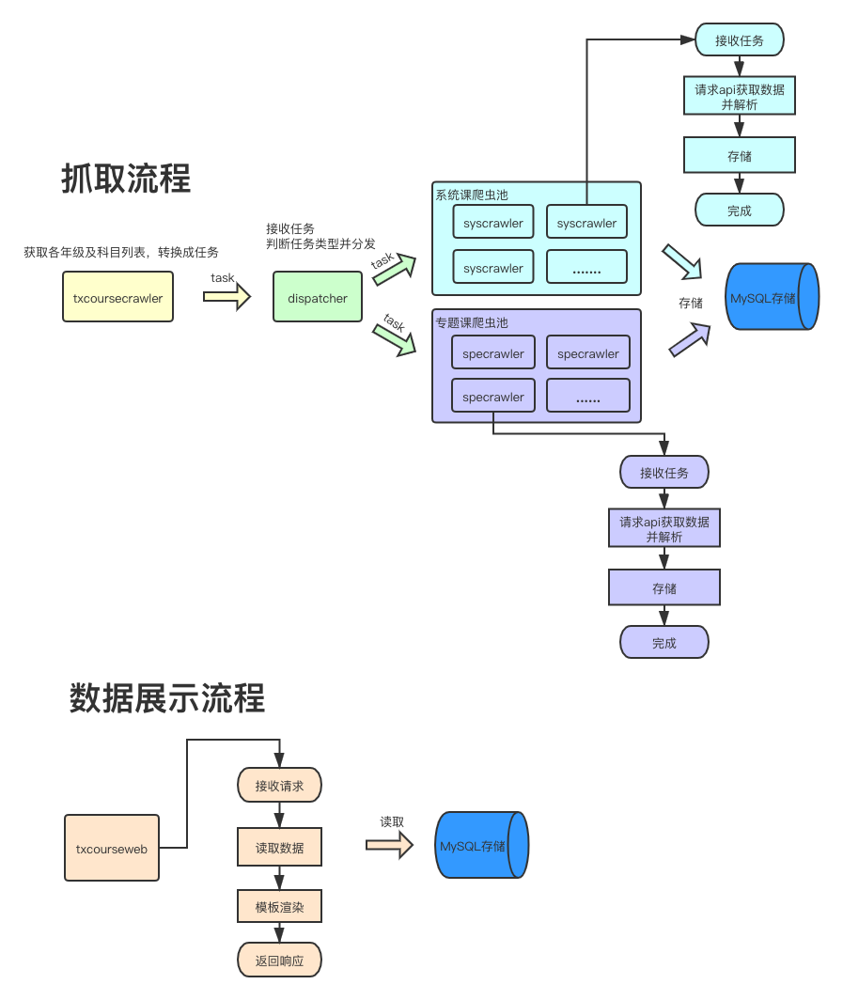

# coursecrawler

本项目主要用来抓取腾讯企鹅辅导官网的数据：[https://fudao.qq.com/](https://fudao.qq.com/), 并提供了一个简易的web后台进行数据展示

## 功能介绍
### 1.数据抓取
抓取功能目前基于原生go语言实现，支持多任务并行抓取，主要抓取3类数据：
 - 各个年级及对应科目列表
 - 各个年级、科目下的系统课
 - 各个年级、科目下的专题课

因目前数据抓取功能主要关注具体课程相关的数据，且分析网站结构发现抓取的系统课、专题课下的课程已覆盖全网课程数据，所以暂未对特训课、热卖课进行抓取

### 2.数据存储
数据存储目前基于MySQL，对各个年级、科目下的课程数据进行存储

### 3.数据展示
项目提供了web后台对抓取的数据进行展示，同时支持历史数据查看，目前主要分为两个页面：
 - 各科目课程数量统计页，统计每天的各个学科课程数量
 - 科目详情页，可查看该科目下每一门课的详情信息，包括课程id、课程标题、价格、老师等信息

## 使用
### 1.数据库设置
项目目前使用MySQL进行数据存储，需要进行一定的配置，如下：
```
1.设置环境变量：
    export MYSQLUser=xxxx //数据库账户
    export MYSQLPass=xxxx //数据库密码
    export MYSQLAddr=xxxx //数据库地址
    export MYSQLPort=xxxx //数据库端口号
    export MYSQLDBName=xxxx //数据库名称
```

### 2.安装
进入项目目录，执行`make`

### 3.运行
`make`命令完成后，即可在`build`文件夹下看到生成的可执行程序：
```
    txcoursecrawler
        用来抓取课程数据，并存储到MySQL，目前支持两个参数:
        -maxspecrawlers int
            专题课爬虫最大并行数量 (default 1)
        -maxsyscrawlers int
            系统课爬虫最大并行数量 (default 1)
    txcourseweb
        web后台，对数据进行展示
```

## 项目流程图


## 方案设计说明
### 抓取
分析源站发现，首先抓取每个年级及年级下的科目列表，然后抓取对应年级与科目下的系统课课程与专题课课程即可完成源站上的所有课程数据抓取，因此将整个抓取流程分为两部分：
 - 1.获取各年级及科目列表
 - 2.获取年级与科目对应的所有系统课课程与专题课课程

对应代码实现主要有以下组件：

#### txcoursecrawler

获取各年级及科目列表，并遍历年级及对应科目列表，针对每个[年级,科目]对生成两个任务并发送给dispatcher，一个对应专题课抓取任务，一个对应系统课抓取任务

#### dispatcher

根据`maxspecrawlers`与`maxsyscrawlers`参数创建对应数量的并行专题课、系统课爬虫，接收`txcoursecrawler`发送的专题课、系统课任务并将任务分发给对应的爬虫执行

#### syscrawler

负责根据任务指定的年级、科目对相应的系统课课程进行抓取、解析、存储

#### specrawler

负责根据任务指定的年级、科目对相应的专题课课程进行抓取、解析、存储

### 存储
使用MySQL存储数据，目前将课程数据按日期存储，方便支持历史数据查询并控制单个表大小，同时新增了`crawl_history`表用来保存历史数据的最小可查日期与最大可查日期

### 展示
使用go原生web服务，同时采用模板进行数据展示，需要注意的是，目前数据库中只存储了科目id，通过对源站的分析可以发现，科目id到科目名称的映射数据来源于js文件，因此项目提取了该文件中的映射并直接硬编码在了代码中

### 关于分布式支持
目前部署多个爬虫实例会导致重复获取任务列表，添加分布式支持需要将获取任务列表独立出来（代码中txcoursecrawler.go部分），通过发布订阅的方式（如消息队列）实现任务投递，然后部署多个爬虫实例（dispatcher+syscrawler+specrawler）进行任务执行
